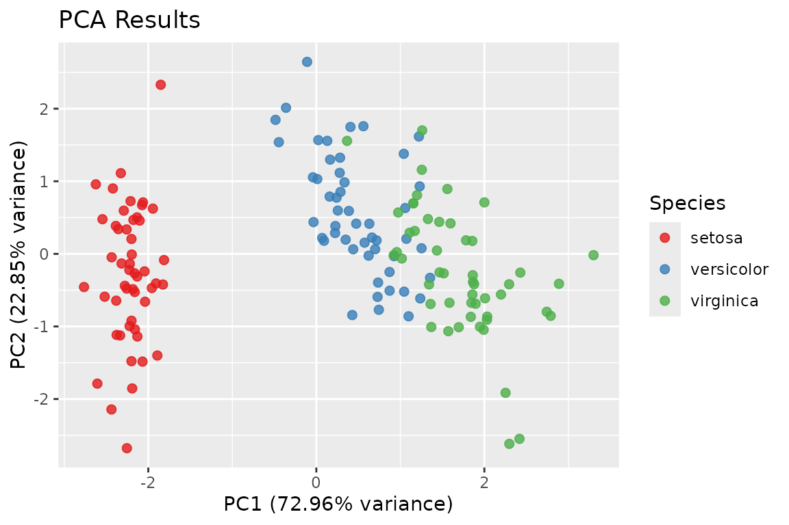

# Dimensionality reduction: fs_pca() and fs_svd()

[`fs_pca()`](https://elkronos.github.io/featR/reference/fs_pca.md) and
[`fs_svd()`](https://elkronos.github.io/featR/reference/fs_svd.md) do
**not** select features. They replace the original columns with a few
new ones, each a linear combination of *all* the inputs. You still have
to measure every variable, and the components are chosen without
reference to any outcome. The highest-variance directions need not be
the ones that predict anything.

Both functions return a plain list rather than an `fs_result`.

## `fs_pca()`

[`fs_pca()`](https://elkronos.github.io/featR/reference/fs_pca.md) runs
a PCA on the numeric columns of a data frame. Character and factor
columns are kept aside as labels. Incomplete rows and zero-variance
columns are dropped before the decomposition, and `meta` records what
was used.

``` r

pca <- fs_pca(iris, num_pc = 2, label_col = "Species")
names(pca)
#> [1] "pc_loadings"   "pc_scores"     "var_explained" "pca_df"       
#> [5] "meta"          "plot"
pca$var_explained
#> [1] 0.7296245 0.2285076
pca$pc_loadings
#>                     PC1         PC2
#> Sepal.Length  0.5210659 -0.37741762
#> Sepal.Width  -0.2693474 -0.92329566
#> Petal.Length  0.5804131 -0.02449161
#> Petal.Width   0.5648565 -0.06694199
head(pca$pca_df)
#>          PC1        PC2 Species
#>        <num>      <num>  <fctr>
#> 1: -2.257141 -0.4784238  setosa
#> 2: -2.074013  0.6718827  setosa
#> 3: -2.356335  0.3407664  setosa
#> 4: -2.291707  0.5953999  setosa
#> 5: -2.381863 -0.6446757  setosa
#> 6: -2.068701 -1.4842053  setosa
pca$meta$n_rows_used
#> [1] 150
```

### Reading the output

- `var_explained` is the share of the **total** variance each retained
  component carries. With two components out of four it sums to less
  than 1.
- `pc_loadings` holds the eigenvectors
  ([`prcomp()`](https://rdrr.io/r/stats/prcomp.html)’s `rotation`), one
  row per input column. Signs are arbitrary. A component and its
  negation are the same component.
- `pc_scores` and `pca_df` hold the coordinates of each observation.

By default columns are centered **and scaled** (`scale_data = TRUE`), so
the PCA is on the correlation matrix. Leave that on unless the columns
share meaningful units. Otherwise the column with the largest variance
dominates.

### Plotting

A ggplot of PC1 against PC2 is built whenever a `label_col` is supplied,
two or more components are kept, and ggplot2 is installed. `plot = TRUE`
also prints it:

``` r

pca$plot
```



### Large data

Below 10 million cells,
[`fs_pca()`](https://elkronos.github.io/featR/reference/fs_pca.md) uses
[`stats::prcomp()`](https://rdrr.io/r/stats/prcomp.html). At or above
that size it uses
[`bigstatsr::big_SVD()`](https://privefl.github.io/bigstatsr/reference/big_SVD.html)
on a temporary file-backed matrix, if bigstatsr is installed, and
computes only the requested components. In that case the total-variance
denominator is computed from column statistics, so `var_explained` still
means share of the whole.

## `fs_svd()`

[`fs_svd()`](https://elkronos.github.io/featR/reference/fs_svd.md) is
the lower-level tool. It takes a numeric matrix `x` and returns singular
values and vectors:

``` r

m <- as.matrix(mtcars)
s <- fs_svd(m, n_singular_values = 3, scale_input = TRUE)
round(s$singular_values, 3)
#> [1] 14.313  9.064  4.409
dim(s$left_singular_vectors)
#> [1] 32  3
dim(s$right_singular_vectors)
#> [1] 11  3
```

`scale_input = TRUE` (the default) centers and scales the columns first,
so the triplets factorize `scale(x)`, not `x`. The squared singular
values divided by `n - 1` are the PCA eigenvalues of the scaled data:

``` r

all_sv <- fs_svd(m)$singular_values
round(all_sv^2 / (nrow(m) - 1), 4)[1:3]
#> [1] 6.6084 2.6505 0.6272
round(prcomp(m, scale. = TRUE)$sdev^2, 4)[1:3]
#> [1] 6.6084 2.6505 0.6272
```

### Exact or approximate

`svd_method = "auto"` uses
[`base::svd()`](https://rdrr.io/r/base/svd.html) unless you ask for
fewer singular values than `min(dim(x))` **and** the matrix is larger
than `svd_threshold` (100) in its smaller dimension. In that case it
uses [`RSpectra::svds()`](https://rdrr.io/pkg/RSpectra/man/svds.html),
which computes only the leading triplets. `svd_method = "approx"` forces
the approximate solver when it is applicable.

``` r

set.seed(1)
big <- matrix(rnorm(400 * 150), 400, 150)
approx <- fs_svd(big, n_singular_values = 5, svd_method = "approx")
exact  <- fs_svd(big, n_singular_values = 5, svd_method = "exact")
all.equal(approx$singular_values, exact$singular_values, tolerance = 1e-6)
#> [1] TRUE
```

Singular vectors are unique only up to sign, so compare them with
[`abs()`](https://rdrr.io/r/base/MathFun.html) or through
reconstructions, not element by element.
